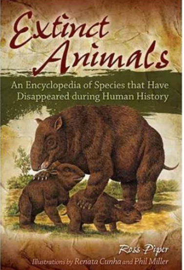

# extinct-animal-website

idea
add soud section to each animal
add when it be extinct
add why it be extinct
add

https://webflow.com/seo?utm_source=dribbble&utm_medium=referral&utm_campaign=partnerships&utm_content=boostedshot

https://www.behance.net/gallery/140960463/The-Museum-of-Modern-Art

https://dribbble.com/shots/21453468-Museum-Website-Concept

phase 1
i will do only frondend and fetch data local

phase 2
i will use api to fetch data and flask in backend

p1
build the landing page

p2
build page routing by flask

p3
fetch data by flask

p4
make subuscibe newsletter give newspaper into your gmail
